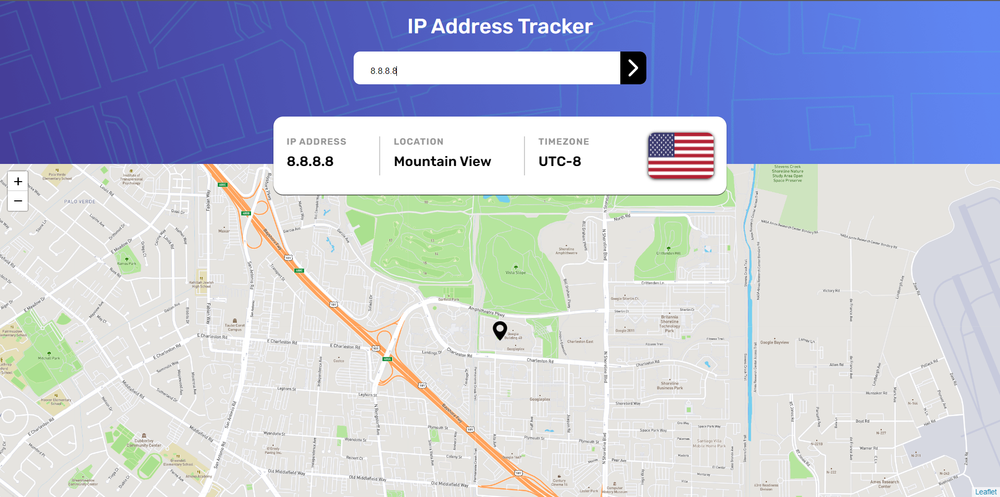

Pequeno site para localização através do ip informado.

<h1 align="center">
  
</h1>

Link url para o site: https://iptracker-icaro.netlify.app/

### 🛠 Tecnologias

As seguintes ferramentas foram usadas na construção do projeto:

- [React](https://pt-br.reactjs.org/)
- [TypeScript](https://www.typescriptlang.org/)
- [Axios](https://github.com/axios/axios)

### Autor
---

<a href="https://blog.rocketseat.com.br/author/thiago/">
 
  
 <b>Icaro Rodrigues</b></a> <a href="https://www.linkedin.com/in/IcaroRodriguesCerqueira/" title="IcaroRodriguesIn">🚀</a>

Feito por Icaro Rodrigues 👋🏽 Entre em contato!

 
